<div align="center">

# 🛡️ AWS-Based Wi-Fi Hybrid Intrusion Detection & Response System

**A cloud-native intrusion detection pipeline that monitors network traffic using Zeek and Suricata, detects anomalous activity with machine learning, and automates incident response using AWS services.**


</div>

---

## 📋 Table of Contents

- [Overview](#-overview)
- [Architecture](#-architecture)
- [Tech Stack](#-tech-stack)
- [Detection Pipeline](#-detection-pipeline)
- [Repository Structure](#-repository-structure)
- [Getting Started](#-getting-started)
- [Incident Response Workflow](#-incident-response-workflow)
- [Monitoring & Reliability](#-monitoring--reliability)
- [Challenges & Lessons Learned](#-challenges--lessons-learned)
- [Future Improvements](#-future-improvements)
- [Contributors](#-contributors)

---

## 🔍 Overview

This project implements an **end-to-end intrusion detection and response system** designed to simulate a real **Security Operations Center (SOC)** workflow. The system:

- 📡 **Collects** network telemetry from Zeek and Suricata sensors
- ⚙️ **Processes** logs through a cloud-native data pipeline
- 🤖 **Detects** anomalous behavior using ML (Random Cut Forest) and graph analytics
- 🔒 **Responds** automatically by isolating affected devices and capturing forensic evidence

The goal was to explore how modern cloud-native architectures can support **scalable detection**, **reduce response time**, and **improve visibility** into network activity.

### Key Concepts

| Concept | Description |
|---------|-------------|
| **NIDS** | Network Intrusion Detection Systems using both signature and anomaly-based approaches |
| **Hybrid Detection** | Combining rule-based (Suricata) with behavioral analysis (ML + Graph) |
| **Automated IR** | Incident response playbooks triggered without human intervention |
| **Defense-in-Depth** | Multiple, layered detection mechanisms to catch diverse attack types |

---

## 🏗️ Architecture

```mermaid
flowchart LR
    subgraph Sensors["🖥️ Network Sensors"]
        Z[Zeek<br/><i>conn.log</i>]
        S[Suricata<br/><i>alerts</i>]
    end

    subgraph Ingestion["📥 Data Ingestion"]
        KF[Kinesis Data<br/>Firehose]
        S3[(Amazon S3<br/>Data Lake)]
    end

    subgraph Processing["⚙️ Feature Engineering"]
        L1[AWS Lambda<br/><i>processIotLogs</i>]
        DDB[(DynamoDB<br/>Feature Store)]
    end

    subgraph Detection["🔎 Detection Engine"]
        SM[SageMaker<br/>Random Cut Forest]
        NP[(Neptune<br/>Graph DB)]
    end

    subgraph Response["🚨 Incident Response"]
        SF[Step Functions<br/>Orchestrator]
        DC[Discord<br/>Alerts]
        CW[CloudWatch<br/>Monitoring]
    end

    Z --> KF
    S --> KF
    KF --> S3
    S3 -->|S3 Event Trigger| L1
    L1 -->|Aggregated Features| DDB
    DDB -->|Scheduled Query| SM
    S3 --> NP
    SM -->|Anomaly Score > Threshold| SF
    NP -->|Lateral Movement Alert| SF
    SF --> DC
    SF --> CW

    style Sensors fill:#232F3E,stroke:#FF9900,color:#fff
    style Ingestion fill:#232F3E,stroke:#FF9900,color:#fff
    style Processing fill:#232F3E,stroke:#FF9900,color:#fff
    style Detection fill:#232F3E,stroke:#FF9900,color:#fff
    style Response fill:#232F3E,stroke:#FF9900,color:#fff
```



---

## 🧰 Tech Stack

| Category | Technologies |
|----------|-------------|
| **Network Sensors** | Zeek (conn.log parsing), Suricata (signature-based alerts) |
| **Stream Ingestion** | AWS Kinesis Data Firehose |
| **Storage** | Amazon S3 (data lake), DynamoDB (feature store) |
| **Compute** | AWS Lambda (serverless event processing) |
| **Machine Learning** | Amazon SageMaker — Random Cut Forest (RCF) anomaly detection |
| **Graph Analytics** | Amazon Neptune (lateral movement detection) |
| **Orchestration** | AWS Step Functions (incident response workflows) |
| **Notifications** | Discord Webhooks, Amazon SNS / EventBridge |
| **Monitoring** | Amazon CloudWatch (metrics, logs, dashboards) |

---

## 🔬 Detection Pipeline

### 1. Data Ingestion

Network telemetry is collected from **Zeek** (connection metadata) and **Suricata** (signature-based alerts) sensors. Logs are streamed through **Kinesis Data Firehose** into an **S3 data lake** organized by source:

```
s3://bucket/
├── zeek-logs/        # Tab-separated conn.log records
└── suricata-logs/    # JSON alert events
```

### 2. Feature Engineering

An **event-driven Lambda function** ([`processIotLogs.py`](processIotLogs.py)) is triggered on every new S3 object. It:

- Parses Zeek conn.logs (tab-separated) and Suricata alerts (JSON)
- Aggregates features into **1-minute time windows** per device
- Writes batched updates to a **DynamoDB** feature table

| Feature | Source | Description |
|---------|--------|-------------|
| `conn_count` | Zeek | Number of connections in the window |
| `orig_bytes_sum` | Zeek | Total bytes sent by the device |
| `resp_bytes_sum` | Zeek | Total bytes received by the device |
| `alert_count` | Suricata | Number of signature-based alerts triggered |

### 3. Machine Learning Detection

A **Random Cut Forest (RCF)** model deployed via **SageMaker** ([`getAnomalyScores.py`](getAnomalyScores.py)) runs on a schedule to:

- Query DynamoDB for the most recent feature window
- Invoke the SageMaker endpoint with the 4-feature vector
- Flag devices with anomaly scores exceeding a configurable threshold (default: `2.0`)
- Send **Discord alerts** for high-confidence anomalies

### 4. Lateral Movement Detection

Network connections are modeled as a **directed graph** in **Amazon Neptune**, enabling detection of:

- 🔗 New, previously unseen internal connections
- 🚪 Connections to risky or unusual ports
- 📈 Abnormal fan-in behavior (many devices connecting to one)

This layer catches **sophisticated attacks** that evade per-device anomaly analysis.

---

## 📁 Repository Structure

```
iot-security-AWS/
├── 01-data-exploration.ipynb           # Data exploration & visualization
├── 02_model_training_and_deployment.ipynb  # RCF model training & SageMaker deployment
├── processIotLogs.py                   # Lambda: log parsing & feature engineering
├── getAnomalyScores.py                 # Lambda: anomaly scoring & Discord alerts
└── README.md
```

---

## 🚀 Getting Started

### Prerequisites

- **AWS Account** with access to S3, Lambda, DynamoDB, SageMaker, Kinesis, Neptune, Step Functions, CloudWatch
- **Python 3.9+**
- **Zeek** and/or **Suricata** installed on a network sensor host
- **Discord Webhook URL** (for alert notifications)

### Deployment Steps

1. **Set up the data pipeline**
   - Create an S3 bucket with `zeek-logs/` and `suricata-logs/` prefixes
   - Configure Kinesis Data Firehose to deliver to S3

2. **Deploy the feature engineering Lambda**
   - Upload `processIotLogs.py` as an AWS Lambda function
   - Set the `TABLE_NAME` environment variable (default: `IotDeviceFeatures`)
   - Configure an S3 event trigger for new object creation

3. **Train and deploy the ML model**
   - Run `01-data-exploration.ipynb` to explore and prepare data
   - Run `02_model_training_and_deployment.ipynb` to train and deploy the RCF model on SageMaker

4. **Deploy the anomaly scoring Lambda**
   - Upload `getAnomalyScores.py` as an AWS Lambda function
   - Set environment variables:
     - `DISCORD_WEBHOOK_URL` — your Discord webhook
     - `ANOMALY_THRESHOLD` — score threshold (default: `2.0`)
     - `DYNAMODB_TABLE_NAME` — feature table name
   - Configure a **CloudWatch Events** schedule (e.g., every 1 minute)

5. **Set up the graph database** (Neptune) and **incident response** (Step Functions) as needed

---

## 🚨 Incident Response Workflow

High-confidence alerts automatically trigger an **AWS Step Functions** playbook:

```mermaid
flowchart TD
    A[🔔 Alert Triggered] --> B{Score > Threshold?}
    B -->|Yes| C[🔒 Isolate Device]
    B -->|No| G[📝 Log & Monitor]
    C --> D[📸 Capture Forensic Evidence]
    D --> E[📢 Notify via Discord]
    E --> F[⏳ Scheduled Rollback]
    F --> G
```



| Step | Action | AWS Service |
|------|--------|-------------|
| **Isolate** | Quarantine the affected device | Step Functions + Lambda |
| **Capture** | Collect forensic evidence snapshots | S3 + Lambda |
| **Notify** | Send rich alert embeds to Discord | Lambda + Discord Webhook |
| **Rollback** | Restore device access after review period | Step Functions |

---

## 📊 Monitoring & Reliability

System health and performance are monitored using **Amazon CloudWatch**:

- **Pipeline Metrics** — ingestion throughput, Lambda invocation counts and errors
- **Detection Latency** — time from log event to anomaly score
- **Workflow Execution** — Step Functions state transitions and failures
- **DynamoDB Capacity** — read/write throughput and throttle events

---

## 🧗 Challenges & Lessons Learned

| Challenge | Insight |
|-----------|---------|
| **Scalable event-driven pipelines** | Batching DynamoDB updates per time window significantly reduced write costs |
| **Time-windowed aggregation** | Managing state across 1-minute windows required careful timestamp alignment |
| **Detection sensitivity** | Tuning the anomaly threshold is an ongoing balance between catch rate and false positives |
| **Normal vs. anomalous behavior** | Baseline profiling is critical — what's "normal" varies dramatically by network |
| **Multi-layer integration** | Combining ML anomaly scores with graph-based lateral movement detection provides layered coverage |
| **AWS cost management** | Serverless architecture helps, but SageMaker endpoints require attention to instance sizing |

---

## 🔮 Future Improvements

- [ ] Integrate **threat intelligence feeds** (STIX/TAXII) for enriched context
- [ ] Build **SIEM dashboard** visualizations (e.g., Grafana, OpenSearch Dashboards)
- [ ] Add **TLS/JA3 fingerprinting** for encrypted traffic analysis
- [ ] Improve **alert correlation** across detection layers
- [ ] Add **automated playbook escalation** based on alert severity
- [ ] Implement **real-time streaming** with Kinesis Data Analytics

---

## 👥 Contributors

| Name | Role | GitHub |
|------|------|--------|
| **Lawrence Nguyen** | Cloud Services, Cloud Infrastructure, Security & Detection | [@lawwmower](https://github.com/lawwmower) |
| **Michael Tran** | Backend Development, AI Algorithm Training | [@mtra0099](https://github.com/mtra0099) |
| **Rhett Atkin** | Contributor | — |

---

<div align="center">

*Built with ☁️ AWS · 🐍 Python · 🔐 Security First*

</div>
